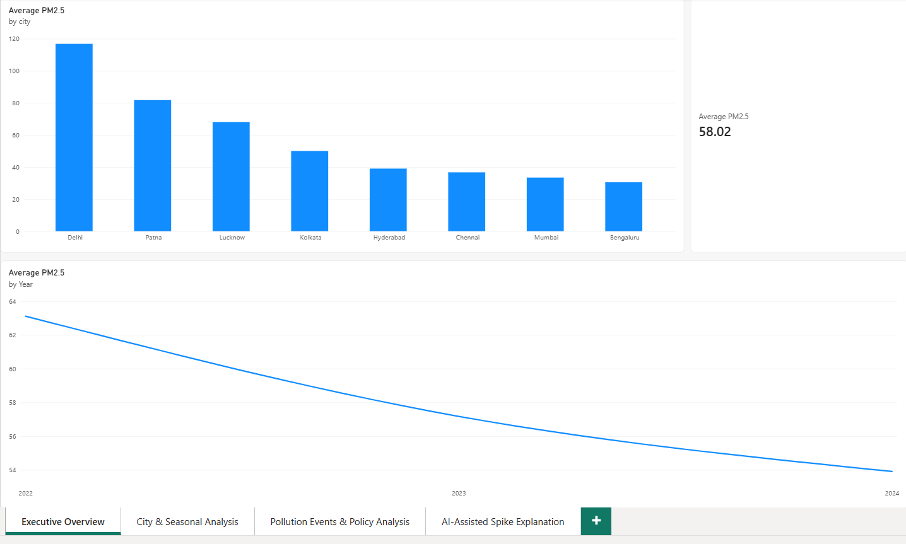
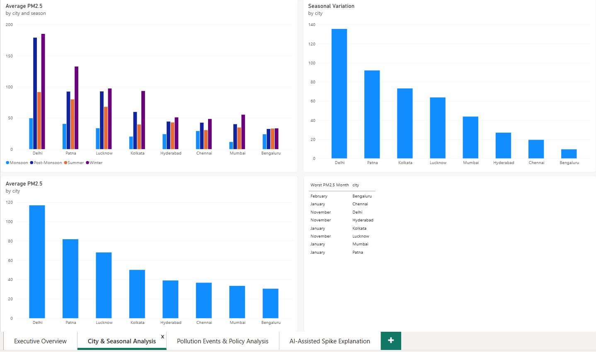
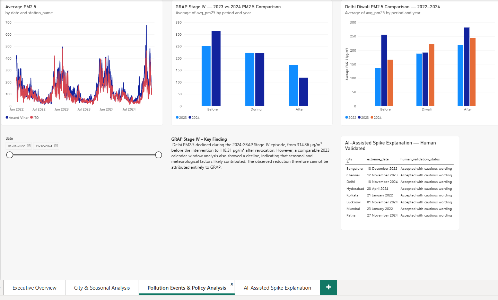
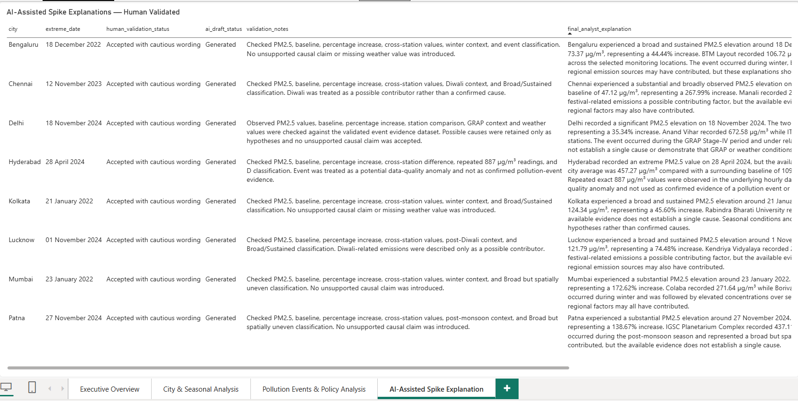
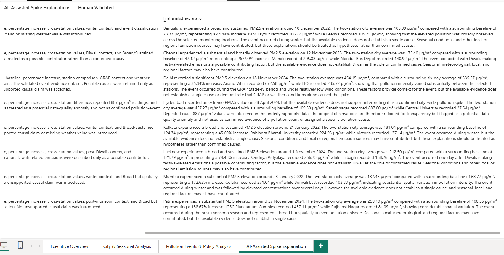

# Air Quality & Pollution Analytics for Indian Cities

## Project Overview

This project analyzes air quality and pollution patterns across selected Indian cities using government monitoring data from the Central Pollution Control Board (CPCB).

The analysis covers 2022–2024 and combines data cleaning, SQL analysis, Python-based exploration, Power BI visualization, policy analysis, and an AI-assisted narrative workflow with human validation.

The project focuses on city-level pollution differences, seasonal patterns, pollution spikes, Diwali-related changes, and the observed changes around Delhi's GRAP Stage IV period.

## Project at a Glance

| | Details |
|---|---|
| **Study period** | 2022–2024 |
| **Cities analyzed** | 8 |
| **Monitoring stations** | 16 |
| **Raw data frequency** | Hourly |
| **Primary analytical level** | Daily station-level |
| **Primary pollution indicator** | PM2.5 |
| **Data source** | CPCB CAAQMS |
| **Tools** | Python, PostgreSQL, SQL, Power BI, Excel |
| **Key analysis** | City trends, seasonality, pollution spikes, Diwali, GRAP Stage IV |
| **AI component** | AI-assisted spike explanations with human validation |

## Objectives

- Analyze air pollution levels across selected Indian cities.
- Compare PM2.5 and other major pollutants across cities and years.
- Identify seasonal pollution patterns and high-pollution periods.
- Examine major pollution spikes and assess their spatial consistency.
- Analyze changes around selected policy/intervention periods.
- Compare Delhi's GRAP Stage IV period with a comparable 2023 calendar window.
- Examine PM2.5 patterns around Diwali across 2022–2024.
- Use an AI-assisted narrative workflow to generate draft explanations for identified pollution spikes.
- Human-validate and correct AI-generated explanations before presenting them.

## Data Source

The primary data source for this project is the Central Pollution Control Board (CPCB) Continuous Ambient Air Quality Monitoring System (CAAQMS).

The raw data consists of station-level hourly observations collected from CPCB monitoring stations. The data includes pollutants such as PM2.5, PM10, NO2, NH3, SO2, CO, and Ozone, along with selected meteorological variables.

The analysis-ready datasets were created by cleaning, validating, combining, and aggregating the raw station-level observations.

### Data Scope

- Period: 2022–2024
- Cities: 8
- Monitoring stations: 16
- Frequency of raw observations: Hourly
- Main analytical level: Daily station-level data
- Primary pollution indicator: PM2.5

## Tools & Technologies

- **Python** — data cleaning, validation, transformation, exploratory analysis, and statistical calculations
- **SQL / PostgreSQL** — structured analysis and aggregation of the cleaned daily dataset
- **Power BI** — interactive dashboard and data visualization
- **Excel** — used to review and inspect exported analytical datasets
- **CPCB CAAQMS data** — primary government monitoring data source
- **AI-assisted workflow** — draft explanations for pollution spikes, followed by human validation and correction

## Project Workflow

```

CPCB raw station data
        ↓
Data cleaning and validation
        ↓
Daily station-level dataset
        ↓
PostgreSQL / SQL analysis
        ↓
Python exploratory and statistical analysis
        ↓
Pollution event and policy analysis
        ↓
AI-assisted spike explanation
        ↓
Human validation and correction
        ↓
Power BI dashboard
        ↓
Excel dataset review
        ↓
Final findings and documentation

```

## Data Preparation

The raw CPCB station data was prepared through the following steps:

1. Loaded hourly station-level CSV files for 2022–2024.
2. Standardized timestamps and station information.
3. Selected the required pollutant and meteorological variables for processing and analysis.
4. Checked for missing values and invalid negative readings.
5. Investigated unusual observations and repeated values.
6. Retained valid observations while flagging potential data-quality anomalies rather than automatically deleting them.
7. Aggregated hourly observations into daily station-level values.
8. Combined the cleaned station datasets into a master analytical dataset.
9. Performed final quality checks for duplicate station-date records and invalid values.
10. Created Power BI-ready data with additional year, month, quarter, and season fields.

## Quality Control

- Master daily dataset: **17,536 rows**
- Monitoring stations: **16**
- Cities: **8**
- Date range: **1 January 2022 – 31 December 2024**
- Duplicate station-date records: **0**
- Negative pollutant values: **0**
- Potential data-quality flags: **3**

## SQL Analysis

The cleaned daily station dataset was loaded into PostgreSQL for structured analysis.

The SQL analysis included:

- Average PM2.5 by city
- Average levels of major pollutants by city
- Monthly PM2.5 trends
- Year-over-year PM2.5 comparison
- Station-level comparison within cities
- Seasonal PM2.5 analysis
- Worst pollution months
- Yearly city-level PM2.5 trends
- Percentage change between 2022 and 2024

SQL was used to identify patterns and generate evidence that was later used in the Python analysis and Power BI dashboard.

## Python Analysis

Python was used for data validation, exploratory analysis, event detection, weather-context analysis, and preparation of analytical datasets for visualization.

The Python analysis included:

- Data-quality checks and validation
- City-level and station-level comparisons
- Seasonal analysis
- Identification of extreme pollution days
- Comparison of pollution spikes with baseline periods
- Weather-context analysis for selected extreme events
- Diwali period comparison
- GRAP Stage IV before/during/after analysis
- Preparation of evidence datasets for the AI-assisted narrative workflow

## Policy & Event Analysis

The project includes focused analysis of selected pollution-related events and interventions.

### Diwali Analysis

Delhi PM2.5 was compared across three periods for each year:

- Before Diwali: 7 days before the festival
- Diwali: festival date
- After Diwali: 7 days after the festival

The analysis covers 2022, 2023, and 2024.

The results show that post-Diwali PM2.5 was higher than the pre-Diwali level in all three years. However, the year-to-year patterns differed, so the observed changes were not treated as being caused by Diwali alone.

### GRAP Stage IV Analysis

Delhi PM2.5 was compared before, during, and after the 2024 GRAP Stage IV period.

A comparable calendar-window analysis from 2023 was also included to provide context for seasonal and meteorological effects.

The analysis showed a decline in PM2.5 during the 2024 GRAP Stage IV period. However, a decline was also observed during the comparable 2023 window. Therefore, the observed reduction was not attributed entirely to GRAP.

This approach was used to avoid presenting correlation as proof of policy causation.

## AI-Assisted Spike Explanation

An AI-assisted narrative workflow was used to generate draft explanations for identified pollution spikes.

The workflow was intentionally kept human-validated rather than fully automated:

1. Structured evidence for each pollution event was prepared using the analytical datasets.
2. The evidence was provided to an AI model to generate a draft explanation.
3. The draft was reviewed against the underlying data.
4. Unsupported causal claims were removed or corrected.
5. The final analyst explanation and validation status were stored in the AI human-validation dataset, with the supporting evidence retained in the analytical evidence dataset.

The AI workflow was instructed to:

- Use only the provided analytical evidence.
- Distinguish observed facts from possible explanations.
- Avoid claiming causation without direct evidence.
- Treat weather conditions as context rather than proof of cause.
- Consider confounding factors such as seasonality, Diwali, crop-burning periods, and winter inversion.
- Respect identified data-quality anomalies.
- Avoid inventing missing information or modifying measurements.

All eight identified extreme events were reviewed through the human-validation process.

## Key Findings

### City-Level Pollution

- Delhi recorded the highest average PM2.5 among the eight cities in the study.
- Bengaluru recorded the lowest average PM2.5 among the selected cities.
- Pollution levels varied substantially between cities, highlighting differences in seasonal and local pollution patterns.

### Seasonal Patterns

- Delhi, Patna, Lucknow, and Kolkata showed strong seasonal variation, with higher PM2.5 levels during winter and post-monsoon periods.
- Bengaluru showed a much smaller seasonal range than the other cities.
- Monsoon periods generally showed lower PM2.5 levels across the selected cities.

### Year-to-Year Changes

Between 2022 and 2024:

- Delhi's average PM2.5 increased.
- Chennai's average PM2.5 increased.
- Mumbai, Bengaluru, Patna, and Kolkata showed decreases.
- Hyderabad and Lucknow showed relatively small changes.

### Pollution Events

Extreme pollution events were not interpreted uniformly. Most events showed broad city-level increases, while some were spatially uneven or affected by potential data-quality issues.

A repeated high-value pattern at Hyderabad's Sanathnagar station was retained and flagged as a potential data-quality anomaly rather than being interpreted as a normal pollution event.

### Policy and Festival Context

The Diwali and GRAP analyses show changes in PM2.5 around these periods, but the project avoids attributing those changes to a single cause because seasonality, meteorology, and other concurrent factors can influence pollution levels.

## Power BI Dashboard

The Power BI dashboard is organized into four pages:

### 1. Executive Overview
- Overall average PM2.5
- Average PM2.5 by city
- Average PM2.5 by year

### 2. City & Seasonal Analysis
- Average PM2.5 by city and season
- Seasonal variation by city
- City and worst PM2.5 month table

### 3. Pollution Events & Policy Analysis
- Daily Delhi PM2.5 trend by monitoring station
- GRAP Stage IV comparison
- Diwali PM2.5 comparison
- AI-assisted spike summary

### 4. AI-Assisted Spike Explanation
- Extreme pollution event details
- AI draft status
- Human validation status
- Validation notes
- Final analyst explanations

## Power BI Dashboard Screenshots

### Executive Overview



### City & Seasonal Analysis



### Pollution Events & Policy Analysis



### AI-Assisted Spike Explanation





## Excel Analysis

Excel was used as a supporting tool to review and inspect exported analytical datasets.

For this project, the `ai_spike_evidence_2022_2024.csv` dataset was opened in Excel to review the structured evidence prepared for the AI-assisted spike explanation workflow.

The main data cleaning, validation, analysis, SQL work, policy and event analysis, and dashboard development were performed using Python, PostgreSQL, and Power BI.

## Project Structure

```

air quality and pollution analytics/
│
├── data/
│   ├── raw/
│   ├── processed/
│   ├── processed_validation/
│   └── reference/
│
├── prompts/
│   └── spike_explanation_prompt.txt
│
├── screenshots/
│   ├── executive-overview.png
│   ├── city-seasonal-analysis.png
│   ├── pollution-policy-analysis.png
│   ├── ai-spike-explanation.png
│   └── ai-spike-explanation-continued.png
│
├── src/
│   ├── analysis.py
│   ├── clean_anand_vihar.py
│   ├── combine_daily.py
│   ├── data_quality_report.py
│   ├── prepare_powerbi.py
│   ├── process_station.py
│   ├── qc_flags.py
│   └── validate_ai_output.py
│
├── README.md
└── air_quality_pollution_analytics.pbix

```

The data/raw folder contains the original station-level CPCB files.

The data/processed folder contains cleaned, aggregated, validated, and analysis-ready datasets.

The data/reference folder contains supporting CPCB reference material.

The prompts folder contains the controlled prompt used for the AI-assisted spike explanation workflow.

The src folder contains the Python scripts used for data cleaning, processing, quality checks, analysis, Power BI preparation, and AI-output validation.

The Power BI dashboard is stored in the project root as the .pbix file.

## Limitations

- The analysis covers eight selected Indian cities and 16 monitoring stations, so the results should not be treated as representative of every city or monitoring station in India.
- The study period is limited to 2022–2024.
- Pollution measurements can be affected by monitoring coverage, missing observations, instrument behavior, and data-quality issues.
- PM2.5 is used as the primary pollution indicator in many analyses, while AQI and other pollutants provide additional context.
- Policy-period comparisons are observational and do not establish causal effects because weather, seasonality, background pollution, and other concurrent factors may influence pollution levels.
- The Diwali analysis identifies changes around the festival period but does not establish that Diwali alone caused the observed changes.
- The GRAP analysis uses a comparable 2023 calendar window to provide additional context, but this is not a controlled experiment.
- The AI-assisted spike explanations are draft analytical narratives and were reviewed and human-validated before being included in the project.
- Potential data-quality anomalies were retained and flagged rather than automatically removed when there was insufficient evidence to justify modifying the original measurements.

## Reproducibility

The project was developed using Python, PostgreSQL, Power BI, and Excel.

The general workflow for reproducing the analysis is:

1. Obtain the required raw CPCB station-level CSV files from the relevant CPCB monitoring data source and place them in `data/raw/`. The raw source files are not included in this repository because of their size.
2. Use the Python scripts in `src/` to clean, process, validate, and combine the station-level data.
3. Store the resulting analysis-ready datasets in `data/processed/`.
4. Load the cleaned daily dataset into PostgreSQL for SQL analysis.
5. Use the Python analysis scripts to generate event, policy, weather-context, and AI-validation datasets.
6. Load the Power BI-ready dataset and supporting analysis files into Power BI.
7. Open `air_quality_pollution_analytics.pbix` to explore the completed dashboard.

The exact processing steps and analytical outputs are documented throughout this README and in the project files.

## Conclusion

This project demonstrates an end-to-end data analytics workflow using real government air-quality monitoring data.

The analysis combines data cleaning and validation, SQL-based analysis, Python exploratory analysis, policy and event comparisons, Power BI visualization, and an AI-assisted narrative workflow with human validation.

The findings show substantial differences in pollution levels and seasonal behavior across the selected cities. The event and policy analyses also demonstrate why pollution changes should be interpreted using multiple sources of evidence rather than attributing changes to a single factor.

Overall, the project focuses on building a reproducible analytical workflow while clearly distinguishing observed patterns, contextual explanations, data-quality issues, and conclusions supported by the available evidence.


